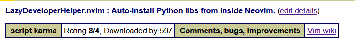

<b>Status as of July 1st, 2025</b>:
🎉 Plugin released successfully!
*If you spot bugs or have ideas for improvements, feel free to open an issue or PR.*
---

<b>Status as of: 09/07/2025</b>:
*Added Future Features section, PR to Awesome-NeoVim accepted, waiting to merge.*

---

<b>Status as of: 11/07/2025</b>:
*Does first steps to auto-detecting languages and separating libraries manager. Also waiting merge to Awesome-NeoVim.*

---
<b>Status as of: 14/07/2025</b>:
*Plugin repository was merged in Awesome-NeoVim succefully, waiting for merge in NeoVimCraft.*

---
<b>Status as of: 15/07/2025</b>:
*Added Rust libraries supporting, but available one minus - your Cargo.toml need to be in one folder with your .rs file. Sorry, and i`ll fix it soon!*

---
<b>Status as of 16/07/2025</b>:

*Our first 100 downloads! Thanks you all, guys!*

---
<b>Status as of 23/07/2025</b>:

*Recently added JavaScript libraries manager, I need 2 weeks break, so I will return at 06/07/2025*
---
<b>Status as of 18.08.2025</b>:
*Almost 300 downloads guys! Thats was too fast, and i will add the C-lang support soon, so prepare for new wave of updates!*

---

<b>Status as of 26/08/2025</b>:
 
Already 400 downloads! Thats impressive, thanks you all for this, and I have one news - i will try go back to this repository because i need fix some problems in my live, so i will unactive on this project

---
<b>Status as of 07.09.2025</b>:
*Already 600 downloads, thats fucking fast, and thanks for 8 rating! From now i will try to combinate school & code & my life, so updates will be, but not too much as it was before! Thanks for this all!*

---
<b>Status as of 29/08/2025</b>:

And, for 2 days - we already have 500 downloads - plugin is growning, I am afk (Because trying to fix all issues in my life, like as with school, sleep, and etc, see screeshot:

Sorry!

---

<b>Status as of 23/09/2025</b>:

I was afk too much time, but already downloading this - thank for downloadings, and I think i can go back to projects, but I need time for some adaptive period to coding, school, my new sleep-mode, and just day schedule.
Thanks for attention, i going to sleep (its now 0:50)!

